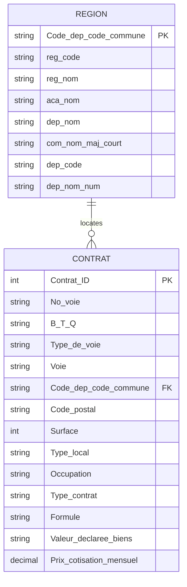

<p align="center">
  
</p>

<h1 align="center">Home Insurance SQL Database Project</h1>

<p align="center">
  Relational database design, data integrity validation<br>
  and SQL analysis for a home insurance dataset
</p>

<p align="center">
  
  
  
  
</p>

---

## Overview

This project focuses on designing, creating, populating, validating, and querying a relational database for a **home insurance dataset**.

Its purpose is to transform two source files, `Contrat.csv` and `Region.csv`, into a structured MySQL database that connects insurance contracts to a geographic reference system.

The project covers the complete database workflow:

- source-data analysis;
- relational database modeling;
- table creation with primary and foreign key constraints;
- CSV data import through MySQL Workbench;
- post-import data normalization;
- row-count and referential-integrity validation;
- SQL analyses answering business questions;
- screenshots documenting each query and its result.

## Objectives

- Analyze the structure and purpose of the source data.
- Build a clear and consistent relational database.
- Preserve geographic and postal codes in the correct format.
- Enforce entity integrity through primary keys.
- Enforce referential integrity between contracts and geographic data.
- Validate imported row counts and detect possible orphan records.
- Normalize inconsistent geographic labels after import.
- Use SQL to answer insurance-related business questions.
- Document the database model, implementation process, and analysis results.

## Source Data

| File | Content | Destination table |
|---|---|---|
| `Region.csv` | Regions, academies, departments, communes, and geographic codes | `region` |
| `Contrat.csv` | Addresses, housing characteristics, insurance formulas, declared property values, and monthly premiums | `contrat` |

The `region` table acts as the geographic reference table. Despite its name, it contains information at several geographic levels: **region, academy, department, and commune**.

## Data Workflow


## Final Relational Model

The final model contains two tables linked through the shared geographic identifier `Code_dep_code_commune`.



### Tables and Keys

| Table | Role | Primary key | Foreign key | Validated rows |
|---|---|---|---|---:|
| `region` | Geographic reference for regions, departments, and communes | `Code_dep_code_commune` | — | 38,919 |
| `contrat` | Home insurance contracts and insured-property characteristics | `Contrat_ID` | `Code_dep_code_commune` → `region.Code_dep_code_commune` | 30,335 |

### Cardinality

- One geographic entry in `region` can be associated with zero, one, or several contracts.
- Each row in `contrat` must reference exactly one existing geographic entry.
- The relationship is therefore **one-to-many (1:N)** from `region` to `contrat`.
- The foreign key prevents the creation of contracts without a matching geographic reference.

## Table Structure

### `region`

The `region` table contains the geographic reference data used to locate each insured property.

| Column | SQL type | Description |
|---|---|---|
| `Code_dep_code_commune` | `VARCHAR(6)` | Unique geographic identifier and primary key |
| `reg_code` | `VARCHAR(2)` | Region code |
| `reg_nom` | `VARCHAR(50)` | Region name |
| `aca_nom` | `VARCHAR(50)` | Academy name |
| `dep_nom` | `VARCHAR(60)` | Department name |
| `com_nom_maj_court` | `VARCHAR(80)` | Short commune name in uppercase |
| `dep_code` | `VARCHAR(3)` | Department code |
| `dep_nom_num` | `VARCHAR(80)` | Department name with its code |

### `contrat`

The `contrat` table contains contract, address, housing, coverage, and pricing information.

| Column | SQL type | Description |
|---|---|---|
| `Contrat_ID` | `INT` | Unique contract identifier and primary key |
| `No_voie` | `VARCHAR(10)` | Street number; nullable because some addresses do not provide one |
| `B_T_Q` | `CHAR(1)` | Address suffix information such as bis, ter, or quater |
| `Type_de_voie` | `VARCHAR(10)` | Street type |
| `Voie` | `VARCHAR(100)` | Street name |
| `Code_dep_code_commune` | `VARCHAR(6)` | Geographic identifier and foreign key to `region` |
| `Code_postal` | `VARCHAR(5)` | Postal code |
| `Surface` | `INT` | Housing surface |
| `Type_local` | `VARCHAR(30)` | Type of insured housing |
| `Occupation` | `VARCHAR(30)` | Occupation status of the housing |
| `Type_contrat` | `VARCHAR(40)` | Contract category |
| `Formule` | `VARCHAR(30)` | Insurance formula |
| `Valeur_declaree_biens` | `VARCHAR(30)` | Declared-value category for insured property |
| `Prix_cotisation_mensuel` | `DECIMAL(10,2)` | Monthly insurance premium |

## Technical Design Choices

- **InnoDB** is used to support foreign keys and transactional integrity.
- **`utf8mb4_unicode_ci`** preserves French characters and provides Unicode-compatible comparisons.
- Geographic and postal codes use `VARCHAR` rather than numeric types so that leading zeros are retained.
- `No_voie` uses `VARCHAR(10)` because street numbers may be missing or contain non-numeric information.
- `Prix_cotisation_mensuel` uses `DECIMAL(10,2)` to store monetary values without floating-point approximation.
- Tables are dropped in child-to-parent order and populated in parent-to-child order to respect the foreign key relationship.

## SQL Files

| File | Purpose |
|---|---|
| `01_creation_bdd.sql` | Creates the database, the two tables, and their primary and foreign key constraints |
| `02_verifications_import.sql` | Checks imported row counts, inserts the three missing La Réunion geographic references, normalizes regional labels, and validates referential integrity |
| `03_requetes_analyses.sql` | Contains the 12 required business queries and 3 additional analyses |

## Database Creation and Import

The database is created with the following configuration:

```sql
CREATE DATABASE IF NOT EXISTS oc_assurance_habitation
CHARACTER SET utf8mb4
COLLATE utf8mb4_unicode_ci;
```

### Execution Order

1. Execute `01_creation_bdd.sql` in MySQL Workbench.
2. Import `Region.csv` into the `region` table.
3. Execute sections 1 to 4 of `02_verifications_import.sql` to:
   - verify the imported region row count;
   - insert the three missing La Réunion geographic references;
   - normalize the regional labels;
   - verify the corrected geographic values.
4. Import `Contrat.csv` into the `contrat` table.
5. Execute sections 5 to 9 of `02_verifications_import.sql` to:
   - verify the imported contract row count;
   - validate the final row counts;
   - verify referential integrity;
   - check the La Réunion entries;
   - preview the imported data.
6. Execute the 12 required queries and the 3 additional analyses from `03_requetes_analyses.sql`.

This order is required because `region` is the parent table and `contrat` depends on it through a foreign key.

## Validated Data Volumes

| Table | Number of rows |
|---|---:|
| `region` | 38,919 |
| `contrat` | 30,335 |

`Region.csv` initially contains 38,916 rows. Three missing geographic references related to La Réunion are added before importing `Contrat.csv`, producing a final total of 38,919 rows.

These additional entries ensure that every contract foreign key already exists in the parent table before the contract data is imported.

## Post-Import Data Normalization

Several regional labels required normalization after import to ensure consistent grouping and readable results.

The verification script standardizes:

- `Provence-Alpes-Côte d'Azur`;
- `Auvergne-Rhône-Alpes`;
- `Bourgogne-Franche-Comté`;
- `La Réunion`.

La Réunion is normalized with region code `4` so that its contracts are grouped on a single row in the regional analysis.

## Data Integrity Checks

The primary key constraints enforce row uniqueness in both tables.

The post-import validation queries check:

- the number of rows imported into each table;
- the normalization of regional labels;
- the existence of every geographic reference used by a contract;
- the absence of contracts without a matching row in `region`;
- the consistency of the one-to-many relationship.

Referential integrity is verified with a `LEFT JOIN`:

```sql
SELECT COUNT(*) AS contracts_without_region
FROM contrat AS c
LEFT JOIN region AS r
    ON r.Code_dep_code_commune = c.Code_dep_code_commune
WHERE r.Code_dep_code_commune IS NULL;
```

Validated result:

```text
Contracts without region: 0
```

This confirms that all 30,335 contracts are linked to an existing geographic entry.

## Business Analyses

The project includes **12 required SQL queries** covering:

- filtering contracts by postal code;
- listing distinct regions;
- counting main-residence contracts;
- identifying the properties with the largest surfaces;
- calculating average monthly insurance premiums;
- grouping contracts by declared property value;
- counting a specific insurance formula within a region;
- filtering houses within a selected department;
- calculating the average housing surface in Paris;
- ranking departments by average monthly premium;
- identifying communes with at least 150 contracts;
- counting contracts by region.

Three additional queries extend the analysis by studying:

- the average premium by housing type;
- the number of contracts by occupation status;
- the communes with the highest contract volumes.

## Example Query

```sql
SELECT
    Contrat_ID,
    Surface
FROM contrat
WHERE Code_postal = '92100'
ORDER BY Contrat_ID;
```

This query lists the contract identifiers and housing surfaces for properties located in postal code `92100`.

## Screenshots

The `screenshots/` folder contains evidence of the SQL queries executed in MySQL Workbench.

Each screenshot displays:

- the executed SQL query;
- the result grid returned by MySQL Workbench;
- the data used to answer the corresponding project question.

The folder documents the successful execution of the **12 required queries** and the **3 additional analyses**.

## Technologies Used

- MySQL
- MySQL Workbench
- SQL
- SQL Power Architect
- Visual Studio Code
- Git and GitHub

## Skills Demonstrated

- Relational database modeling
- SQL DDL and DML
- Primary and foreign key management
- CSV data import
- Post-import data normalization
- Referential-integrity validation
- Business-oriented SQL analysis
- Technical documentation
- Git version control

## Author

**Stephane-OC** — Project completed as part of a Data Analyst training path.

---

This project demonstrates the ability to transform source data into a reliable relational database, enforce data integrity, normalize imported values, and use SQL to produce clear business insights.